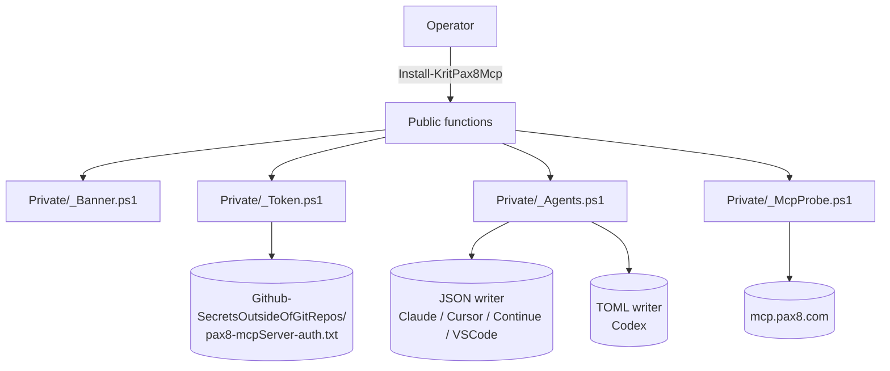

# Krit.Pax8Mcp — Architecture

```text
·· × × × ···  SirJ's Deaddrop  ··· × × × ···
      — If you found this, you were meant to —

---------------- A Seriously Kritical™ Production ----------------
```

Author: Joshua Finley — Kritical Pty Ltd

This document explains the shape of the module: why the layers exist, what each does, and where to put new code.

---

## High-level shape



| Layer | Files | Responsibility |
|---|---|---|
| **Public** | `src/Public/*.ps1` | Operator entry points. Comment-based help. Banner-emitting. Returns structured PSCustomObjects. |
| **Private** | `src/Private/*.ps1` | Internal primitives. Dot-sourced by the root module. Not exported. |
| **Manifest** | `src/Krit.Pax8Mcp.psd1` | Module metadata: Author, Company, Version, FunctionsToExport. |
| **Root** | `src/Krit.Pax8Mcp.psm1` | Dot-sources Private then Public; exports the public functions. |
| **Assets** | `src/Assets/kritical-logo.txt` | Bundled fallback copy of the canonical Kritical banner. |
| **Tests** | `tests/` | Pester unit + e2e + the runner. |

---

## Public function inventory

| Function | Purpose | State change | Live network calls |
|---|---|---|---|
| `Install-KritPax8Mcp` | Wire one or more agents | Backups + edits agent config files | 1× initialize + 1× tools/list (optional) |
| `Get-KritPax8McpStatus` | Read-only inventory | None | None |
| `Test-KritPax8Mcp` | 7-gate health probe | None | 3× (discovery + initialize + tools/list) |
| `Update-KritPax8McpToken` | Rotate token + re-wire | Backups + edits token file + re-runs Install | 1× initialize |
| `Remove-KritPax8Mcp` | Uninstall | Backups + edits agent config files | None |
| `Write-KritPax8Banner` / `Get-KritPax8Banner` | Brand helpers | None | None |

---

## Private primitives

### `_Banner.ps1`

- `Get-KritPax8BannerCanonicalPath` — resolves the canonical banner path. Prefers `Github-SecretsOutsideOfGitRepos\KriticalLogo.txt` (operator copy); falls back to `src/Assets/kritical-logo.txt` (bundled).
- `Get-KritPax8Banner` — returns string. Honours `-Title` (appends `--- title ---`) and `-Compact` (one-liner).
- `Write-KritPax8Banner` — host write with brand colours.

Reasoning: the canonical copy in the operator's secrets folder lets a single edit propagate; the bundled fallback lets a fresh PSGallery install render correctly on a machine without the secrets folder.

### `_Token.ps1`

- `Get-KritPax8TokenPath` — builds the canonical token path. Defaults to operator OneDrive secrets folder.
- `Read-KritPax8Token` — reads + trims. Throws on missing / empty / suspiciously-short. `-AllowMissing` switch for soft-probe callers.
- `Test-KritPax8TokenSane` — pure validator. No I/O.

### `_McpProbe.ps1`

- `Test-KritPax8McpOAuthDiscovery` — HTTPS GET to RFC 8414 metadata. Returns parsed Issuer / AuthorizeEndpoint / TokenEndpoint / RegistrationEndpoint / Scopes / CodeChallengeMethods.
- `Invoke-KritPax8McpInitialize` — JSON-RPC `initialize` POST with `x-pax8-mcp-token` header. Parses SSE-wrapped JSON. Returns ServerName / ServerVersion / Ok.
- `Get-KritPax8McpToolList` — JSON-RPC `tools/list`. Returns ToolCount + Tools[].

### `_Agents.ps1`

- `Get-KritPax8AgentTargets` — emits the 6 canonical agent rows with Path / Format / ConfigExists / HostInstalled / InstallHint.
- `Write-KritPax8JsonAgentConfig` — backup + write for JSON-shape agents. Delegates the actual JSON edit to a Python subprocess to sidestep PowerShell's case-collision foible on `~/.claude.json`.
- `Write-KritPax8TomlAgentConfig` — backup + regex-strip-then-append for TOML-shape agents. Codex doesn't embed the token in TOML (Codex's MCP client does OAuth), so the entry is url-only.
- `Install-KritPax8McpForAgent` — dispatcher that picks the JSON or TOML writer based on the agent's `Format`.

---

## Why Python for JSON edits

Operator's `~/.claude.json` carries project-key entries that have the same path under different casings (`C:/Users/joshl/...` vs `c:/users/joshl/...`). PowerShell's `ConvertFrom-Json` is case-insensitive on hashtable keys and treats these as collisions — it raises:

```
Cannot convert the JSON string because it contains keys with different casing.
```

This is a long-standing PowerShell behaviour with no clean workaround on PowerShell 5.1. PowerShell 7's `-AsHashtable` does the same. Python's `json` module is case-sensitive and handles this cleanly. The module ships a small inline Python snippet via `& $pyExe -c '...'` to do the edit.

If a future Kritical machine has no Python, the module throws a clear "Python 3 required" error rather than corrupting the config.

---

## Why TOML is regex-edited (not parsed)

Codex's `~/.codex/config.toml` is hand-maintained TOML with comments, blank lines, custom formatting. Parsing-rewriting with a TOML library would lose those. The module:

1. Backs up the existing file to `.bak.krit-pax8mcp.<utc>`.
2. Regex-strips any pre-existing `[mcp_servers.pax8]` block (up to next `[section]` or EOF).
3. Appends a fresh `[mcp_servers.pax8]` block.

This is idempotent and preserves everything else verbatim.

---

## Design choices

- **No external runtime dependencies** beyond Python (for the JSON-write path). No external PowerShell modules required to import the module. Pester is only required for running tests.
- **Idempotent everywhere**. Re-running `Install-KritPax8Mcp` is always safe. No "uninstall before reinstall" dance.
- **Backups before every write**. Every config file edited gets a `.bak.krit-pax8mcp.<utc>` snapshot. The token file rotation also auto-backs up.
- **Brand-locked output**. No raw `Write-Host` of operator-facing text without going through the banner first.
- **Structured returns**. Every public function returns a PSCustomObject so the supervisor / Hermes can consume programmatically.
- **Hide agent fingerprints**. No `claude:` / `codex:` / `hermes:` strings appear in output. Only `Kritical` and `Pax8`.

---

## Adding a new agent (HOWTO)

1. Append a row to `Get-KritPax8AgentTargets` in `src/Private/_Agents.ps1`:
   ```powershell
   @{ Name='myagent'; Format='json'; Path=(Join-Path $home '.myagent/mcp.json'); InstallHint='My Agent' }
   ```
2. If new format, write a `Write-KritPax8MyformatAgentConfig` helper.
3. Add a dispatch branch in `Install-KritPax8McpForAgent`.
4. Add Pester unit tests in `tests/Unit/Agents.Tests.ps1` (fresh-write / idempotent / preserve siblings / RemoveOnly).
5. Update the README "Supported agents" table.
6. Update `docs/USAGE.md` "Cross-agent matrix".

---

## Version history

- **1.0.0** (2026-06-24) — Initial release. Claude / Codex / Cursor / Continue / VS Code stable + Insiders supported. Token + OAuth paths. Pester unit + e2e suite.
